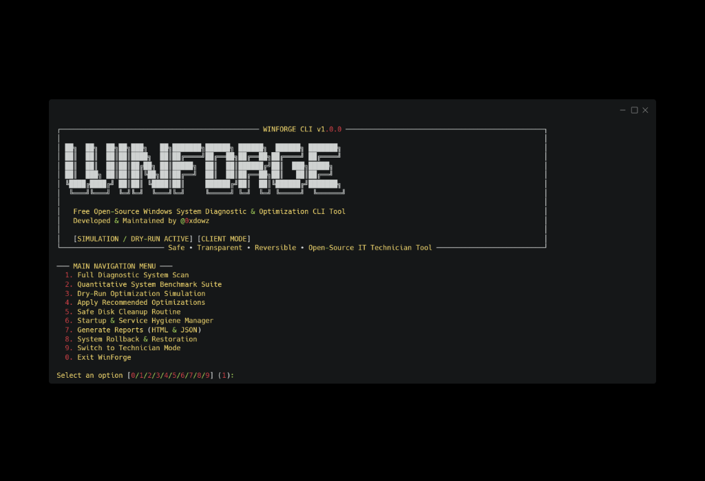

# WinForge :: Windows System Diagnostic & Optimization CLI Framework

```
██╗  ██╗  ██╗██╗███╗   ██╗███████╗██████╗ ██████╗  ██████╗ ███████╗
██║  ██║  ██║██║████╗  ██║██╔════╝██╔══██╗██╔══██╗██╔════╝ ██╔════╝
██║  ██║  ██║██║██╔██╗ ██║█████╗  ██║  ██║██████╔╝██║  ███╗█████╗  
██║  ███╗ ██║██║██║╚██╗██║██╔══╝  ██║  ██║██╔══██╗██║   ██║██╔══╝  
╚████╔████╔╝ ██║██║ ╚████║██║     ██████╔╝██║  ██║╚██████╔╝███████╗
 ╚═══╝╚═══╝  ╚═╝╚═╝  ╚═══╝╚═╝     ╚═════╝ ╚═╝  ╚═╝ ╚═════╝  ╚══════╝
```

[](https://github.com/0xdowz/winforge/actions)
[](LICENSE)
[](https://microsoft.com/windows)
[](https://python.org)
[](CHANGELOG.md)

---

Professional Windows system diagnostic and optimization CLI platform built with safety-first architecture, policy engine guardrails, state-persistence resume execution, and automated LIFO rollback capabilities.

---

## 1. Overview

**WinForge** is a policy-driven, non-destructive Windows system diagnostic and optimization CLI platform created and maintained by **@0xdowz**. Designed for IT technicians, system administrators, and performance enthusiasts, WinForge provides a safe, transparent, and fully reversible environment for Windows health inspection and performance tuning.

Unlike scripts that execute unverified system modifications, WinForge evaluates settings against policy matrix guardrails, creates pre-mutation safety backups (WMI Restore Points, Registry Exports, System Snapshots), and enforces automated LIFO rollback if post-execution state verification fails.

---

## 2. Features

- **System Diagnostic Inspector**: Collects detailed hardware and OS telemetry to compute an internal **WinForge System Health Score (0–100)**.
- **Quantitative Performance Benchmarks**: Measures CPU latency (ms), memory throughput (MB/s), disk sequential write speed (MB/s), timer resolution (ms), and DNS latency (ms).
- **Environment Doctor (`winforge doctor`)**: Verifies Administrator elevation, OS compatibility, hardware status, and 4-Layer Safety Engine readiness.
- **4-Phase Safety Architecture**: Non-privileged preview -> User confirmation -> UAC elevation -> Elevated preflight execution.
- **State-Persistence Elevation Resume (`--resume SESSION_ID`)**: Automatically persists selected profile and candidate tweak choices before elevation so the elevated instance resumes execution without user interaction.
- **Disk Space Safety Gate (>= 5.0 GB)**: Enforces a strict 5.0 GB minimum free disk space safety check on system drive `C:\` to prevent bricking or low-disk lockups.
- **Centralized Schema Validation**: Guarantees zero runtime crashes on malformed tweak metadata with safe fallbacks.
- **Policy-Driven Optimizations**: 6 category modules targeting Gaming latency, Power scheme policies, Startup hygiene, Service optimization, Disk cleanup, and Network settings.
- **Risk Score Intelligence**: Categorizes tweaks (`SAFE`, `MODERATE`, `ADVANCED`, `TECHNICIAN ONLY`) with risk weighting (0–100) ensuring high-risk tweaks require technician confirmation.
- **Portable Binary Execution**: Available as a standalone portable executable (`WinForge.exe`, ~38.8 MB) with embedded multi-resolution custom application icon (`assets/icon.ico`).

---

## 3. Screenshots



*WinForge CLI running in Simulation / Dry-Run Client Mode.*

---

## 4. Safety & Recovery Guarantees

WinForge treats system optimization as a **transactional, state-machine-driven engineering process**:

- **Session-Level System Restore Points**: Creates **ONE** WMI System Restore Point (`WINFORGE_SESSION_TIMESTAMP`) per session.
- **Registry Key Normalization & Export**: Automatically normalizes missing hive prefixes (`SOFTWARE\...` -> `HKLM\SOFTWARE\...`) before exporting `.reg` backups.
- **Pre-State System Snapshots**: Captures full JSON system telemetry prior to modification.
- **Atomic LIFO Rollback Engine**: Reverts applied actions in reverse order if post-apply state verification detects a mismatch.

---

## 5. Usage

```bash
# Non-interactive System Scan & Diagnostics
winforge analyze

# Non-interactive Security Health Audit
winforge security-check

# List verified optimization recipes
winforge tweaks list

# Resume session automatically after elevation
winforge --resume SESSION_20260728_193000_A1B2C3

# Disaster Recovery & Rollback Ledgers
winforge rollback list
winforge rollback SESSION_ID
```
