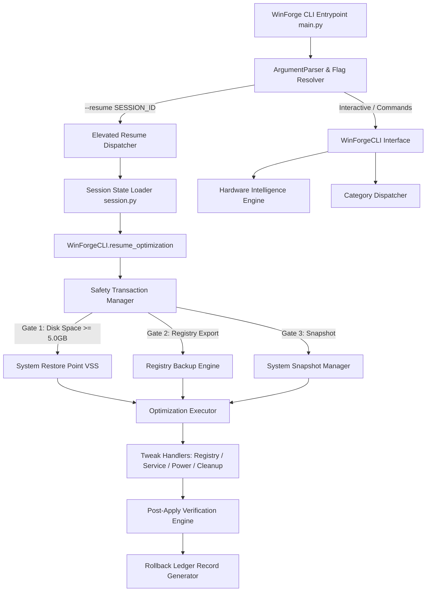
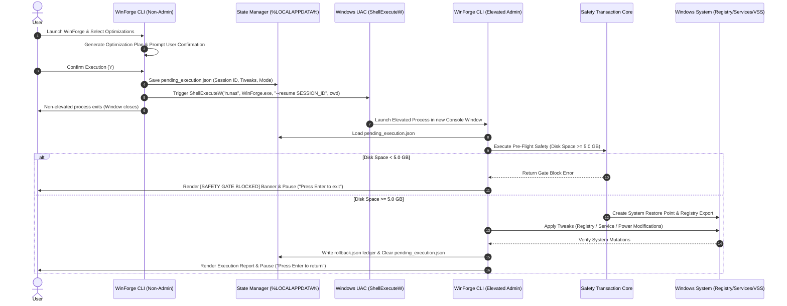
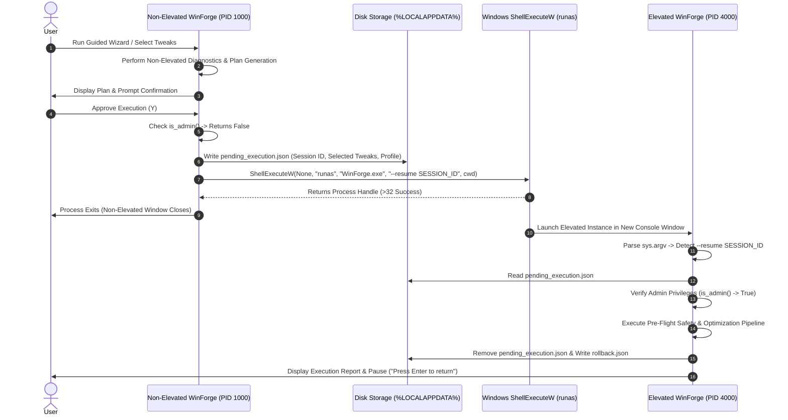

# WinForge v1.0.8 — Autonomous Windows Optimization Framework

[](LICENSE)
[-0078D6.svg?logo=windows)](https://microsoft.com)
[](https://python.org)
[]()
[]()
[]()

**WinForge** is an open-source, non-destructive, enterprise-grade command-line optimization framework for Windows 10 and Windows 11. Designed for system administrators, IT technicians, and power users, WinForge automates performance tuning, privacy hardening, and telemetry mitigation while enforcing a strict 7-Step Safety Transaction Lifecycle.

Unlike legacy "tweak scripts" or opaque GUI cleaning utilities, WinForge operates with **100% offline execution**, **zero telemetry**, **atomic state recording**, and **inverse session rollback guarantees**. Every modification is validated against local system policy, backed up via native Windows Volume Shadow Copy (System Restore) and Registry exports, and recorded in a machine-readable JSON transaction ledger.

---

## Table of Contents

1. [Project Overview](#1-project-overview)
   - [The Problem](#the-problem)
   - [The WinForge Philosophy](#the-winforge-philosophy)
   - [Target Audience](#target-audience)
2. [Feature Overview](#2-feature-overview)
3. [System Architecture](#3-system-architecture)
   - [Component Hierarchy](#component-hierarchy)
   - [Data Flow Diagram](#data-flow-diagram)
4. [Installation & Deployment](#4-installation--deployment)
   - [Option A: Portable Executable (Recommended)](#option-a-portable-executable-recommended)
   - [Option B: Developer Source Installation](#option-b-developer-source-installation)
5. [Complete CLI Documentation](#5-complete-cli-documentation)
   - [Positional Subcommands](#positional-subcommands)
   - [Global Flags](#global-flags)
6. [Optimization Profiles & Capability Tiers](#6-optimization-profiles--capability-tiers)
7. [Safety & Transaction Lifecycle](#7-safety--transaction-lifecycle)
   - [The 7-Step Transaction Core](#the-7-step-transaction-core)
   - [Pre-Flight Disk Safety Gate (5.0 GB)](#pre-flight-disk-safety-gate-50-gb)
   - [Disaster Recovery & Rollback Engine](#disaster-recovery--rollback-engine)
   - [Failure & Interruption Handling Matrix](#failure--interruption-handling-matrix)
8. [Administrator Elevation & State Resume Architecture](#8-administrator-elevation--state-resume-architecture)
   - [The UAC Elevation Lifecycle](#the-uac-elevation-lifecycle)
   - [State Persistence Schema](#state-persistence-schema)
9. [Privacy & Cybersecurity Architecture](#9-privacy--cybersecurity-architecture)
10. [Troubleshooting & Exit Codes](#10-troubleshooting--exit-codes)
11. [Developer Guide & Tweak Recipe Schema](#11-developer-guide--tweak-recipe-schema)
12. [Verification & Testing](#12-verification--testing)
13. [Interface Screenshots](#13-interface-screenshots)
14. [Project Roadmap](#14-project-roadmap)
15. [License & Contribution Policy](#15-license--contribution-policy)

---

## 1. Project Overview

### The Problem
Modern Windows distributions (Windows 10 and 11) run dozens of background services, diagnostics collectors, telemetry agents, and default energy-throttling profiles that degrade system performance, waste storage, and compromise user privacy.

Existing solutions in the Windows utility space suffer from critical flaws:
* **Batch Scripts / PowerShell Gists**: Unverified commands executed without error trapping, baseline state capture, or revert capabilities.
* **Opaque Closed-Source Cleaners**: Undocumented registry edits, bundled telemetry, risk of breaking system components, and zero visibility into operations.
* **Aggressive Tweak Utilities**: Force-removing system dependencies (e.g., breaking Windows Update, Microsoft Store, or Sysprep) with no path to recovery.

### The WinForge Philosophy
WinForge was built on five engineering principles:

1. **Absolute Transparency**: Every optimization is defined in human-readable JSON schema files with full target keys, risk scores, and reversal logic.
2. **Non-Destructive Safety**: Modifications are never applied without verified System Restore Points, Registry hive backups, and baseline system snapshots.
3. **Atomic State Reversibility**: Every session creates a persistent `rollback.json` ledger enabling one-command inverse transaction recovery.
4. **Hardware Intelligence**: Optimizations are dynamically filtered based on CPU architecture, RAM capacity, storage media type (NVMe/SSD vs HDD), and device profile.
5. **Zero Cloud Telemetry**: 100% local, offline execution. No phone-home requests, no analytics tracking, no internet dependencies.

### Target Audience
* **IT Technicians & System Administrators**: Deploy portable, reproducible optimization sessions across client machines.
* **Gamers & Creators**: Maximize GPU scheduling, system responsiveness, and reduce latency without breaking OS functionality.
* **Privacy Conscious Users**: Deactivate background telemetry, diagnostic tracing, and unnecessary Cortana/Maps background brokers.

---

## 2. Feature Overview

| Capability | Technical Implementation | Value |
| :--- | :--- | :--- |
| **Hardware Intelligence Engine v2** | `HardwareIntelligenceEngine` (`winforge/analyzers/hardware_profile.py`) | Auto-detects CPU cores, total RAM, drive types, and power states to recommend optimal profiles. |
| **System Diagnostics** | `SystemHealthReport` (`winforge/models/system.py`) | Deep inspection of OS version, CPU load, RAM allocation, drive space, security state, and active power scheme. |
| **Profile Matrix** | `Beginner`, `Advanced`, `Technician` Risk Tiers | Caps tweak execution strictly based on user risk tolerance (Risk 0–20, 21–50, 51–100). |
| **Safety Transaction Core** | `SafetyTransactionManager` (`winforge/safety/transaction.py`) | Enforces a 7-step atomic execution sequence before applying system mutations. |
| **Rollback System** | `RollbackEngine` (`winforge/safety/rollback_engine.py`) | Reverses session changes in inverse order (`N -> 1`) using transaction log data. |
| **Restore Point Protection** | `create_system_restore_point` (`winforge/safety/restore_point.py`) | Native Windows Volume Shadow Copy (VSS / WMI `SystemRestore`) checkpointing. |
| **Registry Backup Engine** | `export_registry_key` (`winforge/safety/registry_backup.py`) | Export target `HKLM` and `HKCU` registry branches to `.reg` state files prior to modification. |
| **Dynamic Elevation Resume** | `--resume SESSION_ID` (`winforge/core/privileges.py`) | Non-elevated state serialization with ShellExecuteW `runas` relaunch and seamless resume. |
| **Offline Privacy Core** | Local file logging & execution (`winforge/core/logger.py`) | 0 external network requests, 0 remote API calls, zero user metric reporting. |

---

## 3. System Architecture

WinForge is built as a decoupled, modular Python application compiled into a single portable binary using PyInstaller.

```
winforge/
├── main.py                   # CLI entrypoint, argument parsing, & resume dispatch
├── core/                     # Core business logic & execution drivers
│   ├── engine.py             # System scan & session pipeline orchestration
│   ├── privileges.py         # Non-blocking Admin check & ShellExecuteW elevation
│   ├── session.py            # Session folder & pending execution state persistence
│   ├── safety_approval.py    # 4-Layer real-time safety gate evaluation
│   ├── checksums.py          # SHA-256 tweak definition integrity engine
│   ├── logger.py             # Centralized logger & crash handler
│   └── tweak_loader.py       # JSON tweak recipe deserialization & validation
├── cli/                      # Presentation layer & Rich rendering engine
│   ├── interface.py          # WinForgeCLI interactive menu & resume handler
│   ├── theme.py              # Dark enterprise color tokens & renderer manager
│   ├── components.py         # Dashboard, hardware summary, & report cards
│   ├── renderer.py           # Doctor report & safety lock renderers
│   └── wizard.py             # Guided profile optimization wizard
├── models/                   # Pydantic domain models & schemas
│   ├── tweak.py              # Tweak recipe model & schema validator
│   ├── system.py             # System health & diagnostic scan report models
│   ├── rollback.py           # Rollback action & transaction ledger models
│   └── policy.py             # Evaluation finding models
├── safety/                   # System protection & transaction engine
│   ├── transaction.py        # 7-Step Safety Transaction Manager & 5.0GB Disk Gate
│   ├── restore_point.py      # WMI / VSS System Restore Point integration
│   ├── registry_backup.py    # Native reg.exe export & path normalizer
│   ├── snapshot.py           # System state pre/post snapshot engine
│   └── rollback_engine.py    # Inverse atomic rollback executor
├── optimizations/            # Tweak execution dispatchers & handlers
│   ├── executor.py           # OptimizationExecutor 4-phase pipeline manager
│   ├── dispatcher.py         # CategoryDispatcher routing engine
│   ├── verifier.py           # Post-apply tweak verification engine
│   ├── gaming.py             # Gaming & GPU priority optimizer
│   ├── power.py              # Power plan & energy overlay optimizer
│   ├── startup.py            # Startup item & auto-run optimizer
│   ├── services.py           # Service start-type & state optimizer
│   ├── cleanup.py            # Temp & update cache purge optimizer
│   ├── network.py            # TCP auto-tuning & network optimizer
│   └── service_handler.py    # Low-level Windows Service sc.exe controller
├── analyzers/                # Hardware & environment inspection engines
│   ├── hardware.py           # WMI / psutil CPU, RAM, Disk, & GPU collectors
│   ├── hardware_profile.py   # Hardware Intelligence Profile classifier v2
│   ├── os_info.py            # Windows OS edition, build, & UAC state collector
│   └── security.py           # Defender, Firewall, & UAC security auditor
├── licensing/                # Open source offline verification engine
├── security/                 # System security audit engine
└── utils/                    # Absolute path managers & system utilities
    └── paths.py              # App, executable, bundle, and log path resolvers
```

### Component Hierarchy



### Data Flow Diagram



---

## 4. Installation & Deployment

### Option A: Portable Executable (Recommended)
WinForge is distributed as a single, zero-dependency, portable binary. No installer or Python runtime is required on the target machine.

1. Download the latest `WinForge.exe` from the [Releases Page](https://github.com/0xdowz/winforge/releases).
2. Move `WinForge.exe` to a folder of your choice (e.g., `C:\Tools\WinForge\`).
3. Open PowerShell or Command Prompt as Standard User or Administrator:
   ```cmd
   WinForge.exe
   ```

### Option B: Developer Source Installation

#### Prerequisites
* **Operating System**: Windows 10 or Windows 11 (x64)
* **Python Runtime**: Python 3.10, 3.11, 3.12, 3.13, or 3.14
* **Permissions**: Standard User (for scanning/dry-run), Administrator (for execution)

#### Installation Steps

```powershell
# 1. Clone repository
git clone https://github.com/0xdowz/winforge.git
cd winforge

# 2. Create and activate virtual environment
python -m venv venv
.\venv\Scripts\Activate.ps1

# 3. Install dependencies in editable mode
pip install -e .

# 4. Verify installation
python -m winforge.main info
```

#### Building Portable Executable from Source

To compile a standalone binary embedded with multi-resolution icons (`assets/icon.ico`) and configuration data bundles:

```powershell
# Execute centralized PyInstaller build script
python build.py
```

The output executable will be created at `dist/WinForge.exe` (~38.77 MB).

---

## 5. Complete CLI Documentation

WinForge supports both interactive menu navigation and non-interactive command-line flags for scripting and automation.

### Positional Subcommands

```cmd
WinForge.exe [SUBCOMMAND] [SUBARG]
```

| Subcommand | Subarg | Description | Requires Admin |
| :--- | :--- | :--- | :---: |
| `welcome` | *None* | Launches the Guided 3-Step Profile Optimization Wizard | No (Prompts if executing) |
| `scan` | *None* | Runs full non-interactive diagnostic scan & hardware analysis | No |
| `analyze` | *None* | Alias for `scan` | No |
| `optimize` | *None* | Initiates production optimization execution | **Yes** |
| `dry-run` | *None* | Runs complete optimization simulation without system mutations | No |
| `benchmark` | *None* | Runs quantitative system benchmark suite (CPU, RAM, Disk, DNS) | No |
| `doctor` | *None* | Renders Doctor System Environment Summary Report | No |
| `license` | *None* | Displays Open-Source License & Environment Capabilities | No |
| `info` | *None* | Displays WinForge Engine Version, Modules, and Loaded Recipe Count | No |
| `tweaks` | `list` | Lists all 16 verified optimization recipes with Risk Scores & Categories | No |
| `security-check` | *None* | Audits Windows Security state (Defender, Firewall, UAC) | No |
| `rollback` | `list` | Lists available historical session transaction ledgers | No |
| `rollback` | `<SESSION_ID>` | Reverses all transaction actions for specified Session ID | **Yes** |
| `tech` | *None* | Launches CLI directly in Technician Capability Mode | No |

### Global Flags

| Flag | Argument | Description |
| :--- | :--- | :--- |
| `--scan` | *Flag* | Executes diagnostic system scan and exports HTML/JSON reports before exiting |
| `--dry-run` | *Flag* | Forces simulation mode; performs zero registry exports or VSS checkpoints |
| `--execute` | *Flag* | Triggers production optimization execution (Prompts for UAC elevation if non-admin) |
| `--safe` | *Flag* | Filters optimizations to **Beginner Profile Mode** (Risk Score <= 20) |
| `--advanced` | *Flag* | Filters optimizations to **Advanced Profile Mode** (Risk Score <= 50) |
| `--tech` | *Flag* | Enables **Technician Capability Mode** (Unlocks Risk Tier 51–100 recipes) |
| `--resume` | `<SESSION_ID>` | Internal flag used by elevation subsystem to resume pending state |
| `--license-info` | *Flag* | Displays environment verification state |
| `--license-check` | *Flag* | Verifies offline environment integrity |
| `--demo` | *Flag* | Runs read-only preview mode tailored for screenshots |
| `--version` | *Flag* | Prints `WINFORGE v1.0.8 by @0xdowz` and exits |

#### Command Examples

```powershell
# Display system platform information
WinForge.exe info

# Run non-interactive diagnostic scan
WinForge.exe --scan

# Run dry-run simulation of Beginner optimizations
WinForge.exe --safe --dry-run

# List available session rollback ledgers
WinForge.exe rollback list

# Rollback a specific historical optimization session
WinForge.exe rollback SESSION_20260728_180000_123456

# Resume an elevated session manually (if needed)
WinForge.exe --resume SESSION_20260728_204941_9F129E
```

---

## 6. Optimization Profiles & Capability Tiers

WinForge classifies every tweak recipe with a quantitative **Risk Score (0–100)** to prevent accidental system instability.

```
       0 ────────────── 20 ────────────────── 50 ────────────────── 100
Risk:  │   BEGINNER MODE   │    ADVANCED MODE    │  TECHNICIAN MODE   │
       └───────────────────┴─────────────────────┴────────────────────┘
```

### Profile Breakdown

#### 1. Beginner Mode (Risk Score 0 – 20)
* **Target Users**: Everyday Windows users, office workstations, home PCs.
* **Safety Profile**: 100% safe, universally reversible, zero impact on core OS functions.
* **Included Recipe Types**:
  * Temporary folder cache cleanup (`C:\Windows\Temp`, `%TEMP%`)
  * Windows Update download cache purge
  * High-Performance Power Plan overlay creation
  * Non-essential background telemetry brokers delay (Cortana, MapsBroker)
  * System Responsiveness priority adjustments

#### 2. Advanced Mode (Risk Score 21 – 50)
* **Target Users**: Power users, gamers, content creators.
* **Safety Profile**: Safe for modern hardware; modifies power plan USB selective suspend, PCI Express link states, and telemetry services.
* **Included Recipe Types**:
  * USB Selective Suspend deactivation
  * PCIe Link State Power Management tuning
  * Windows Telemetry Service (`diagtrack`) startup mode optimization
  * Retail Demo Service deactivation
  * Network TCP Auto-Tuning optimization

#### 3. Technician Mode (Risk Score 51 – 100)
* **Target Users**: IT Professionals, System Administrators, Field Technicians.
* **Safety Profile**: Requires explicit Technician Mode flag (`--tech`). Modifies low-level system graphics preemption priorities and advanced kernel policies.
* **Included Recipe Types**:
  * DirectX Graphics Preemption Priority tuning (`TWEAK_GAME_004`, Risk 85)
  * Advanced Windows Search policy registry overrides
  * High-risk system service startup reconfiguration

---

## 7. Safety & Transaction Lifecycle

### The 7-Step Transaction Core

WinForge enforces a strict 7-Step Safety Transaction Lifecycle managed by `SafetyTransactionManager` (`winforge/safety/transaction.py`):

```
┌────────────────────────────────────────────────────────────────────────┐
│                      7-STEP SAFETY TRANSACTION LIFECYCLE               │
├────────────────────────────────────────────────────────────────────────┤
│ Step 1: Pre-Flight Safety Verification (Disk Space >= 5.0 GB Gate)     │
│ Step 2: System Restore Point Creation (Windows VSS / WMI SystemRestore)│
│ Step 3: Atomic Registry Hive Export (reg.exe export HKLM/HKCU branches)│
│ Step 4: Baseline Pre-State System Snapshot Generation (snapshot.json)   │
│ Step 5: Optimization Execution (Registry / Service / Power Mutators)   │
│ Step 6: Post-Apply Verification Audit (TweakVerifier Engine)           │
│ Step 7: Persistent Session Report & Rollback Ledger Commit              │
└────────────────────────────────────────────────────────────────────────┘
```

### Pre-Flight Disk Safety Gate (5.0 GB)
Before attempting any system modifications or creating backups, WinForge inspects storage drive space using `get_storage_drives()`.

* **Requirement**: System drive `C:\` must have **>= 5.0 GB free disk space**.
* **Rationale**: Creating a Windows Volume Shadow Copy (System Restore Point) and exporting registry branches requires allocation space. If free space is below 5.0 GB, creating restore points can exhaust disk space or crash system services.
* **Behavior**: If free space is < 5.0 GB, execution is safely halted immediately. WinForge displays an explicit `[SAFETY GATE BLOCKED]` diagnostic banner, logs the event, and pauses cleanly.

### Disaster Recovery & Rollback Engine

WinForge records every individual registry change, service state modification, and power configuration update into a structured JSON ledger at `%LOCALAPPDATA%\WinForge\sessions\<SESSION_ID>\rollback.json`.

#### Sample Rollback Ledger (`rollback.json`)
```json
{
  "transaction_id": "SESSION_20260728_180000_123456",
  "timestamp": "2026-07-28T18:00:00.123456",
  "actions": [
    {
      "tweak_id": "TWEAK_GAME_001",
      "action_type": "REGISTRY_DWORD",
      "target": "HKLM\\SOFTWARE\\Microsoft\\Windows NT\\CurrentVersion\\Multimedia\\SystemProfile\\Tasks\\Games\\GPU Priority",
      "previous_value": "2",
      "new_value": "8",
      "timestamp": "2026-07-28T18:00:01.000000"
    },
    {
      "tweak_id": "TWEAK_STARTUP_002",
      "action_type": "SERVICE_START_TYPE",
      "target": "diagtrack",
      "previous_value": "auto",
      "new_value": "demand",
      "timestamp": "2026-07-28T18:00:02.000000"
    }
  ]
}
```

To reverse an entire optimization session, run:
```powershell
WinForge.exe rollback SESSION_20260728_180000_123456
```
The `RollbackEngine` (`winforge/safety/rollback_engine.py`) iterates through `actions` in **reverse order** (`N -> 1`), restoring previous registry values and service configuration states.

### Failure & Interruption Handling Matrix

| Interruption Event | System State | WinForge Recovery Mechanism |
| :--- | :--- | :--- |
| **Power Loss / Sudden Shutdown** | Unmodified or Partially Applied | baseline `snapshot.json` and `.reg` exports remain saved on disk in `%LOCALAPPDATA%\WinForge\sessions\`. Run `WinForge.exe rollback <SESSION_ID>` or import `backup.reg`. |
| **Individual Tweak Apply Failure** | Previous Tweaks Applied | The `OptimizationExecutor` catches the tweak error, logs the failure traceback, skips the broken tweak, and records applied tweaks to `rollback.json` for partial session recovery. |
| **User Aborts Elevation Prompt** | Unmodified | Non-elevated process exits cleanly with zero system modifications. |
| **Insufficient Disk Space (< 5.0 GB)** | Unmodified | Safety Gate blocks execution before restore points or modifications begin. |

---

## 8. Administrator Elevation & State Resume Architecture

### The UAC Elevation Lifecycle

Because Windows Registry key modification under `HKLM` and Windows Service reconfiguration (`sc.exe` / `ChangeServiceConfigW`) require `SeBackupPrivilege` and Administrator privileges, WinForge implements dynamic UAC elevation with persistent session resume (`--resume SESSION_ID`).



### Why This Design Exists
1. **Zero Unnecessary Elevation**: WinForge allows users to run scans, benchmarks, doctor checks, tweak inspections, and dry-run simulations completely unprivileged. UAC elevation is only requested at the exact moment production execution is approved.
2. **Zero Parameter Loss**: Selecting tweaks in Beginner Mode or Technician Mode is saved to `%LOCALAPPDATA%\WinForge\sessions\pending_execution.json`. When the elevated window opens, execution resumes seamlessly without forcing the user to re-select options.
3. **CWD & Path Independence**: `relaunch_as_admin()` explicitly resolves absolute paths for `sys.executable`, `main_script`, and passes `get_executable_dir()` as `lpDirectory` to `ShellExecuteW`, eliminating working directory resolution errors when spawned from `C:\Windows\system32`.

### State Persistence Schema (`pending_execution.json`)
```json
{
  "session_id": "SESSION_20260728_204941_9F129E",
  "created_at": "2026-07-28T20:49:41.123456",
  "mode": "BEGINNER",
  "max_risk": 20,
  "selected_tweaks": [
    "TWEAK_GAME_001",
    "TWEAK_POWER_001",
    "TWEAK_STARTUP_001",
    "TWEAK_CLEAN_001"
  ],
  "execute": true,
  "dry_run": false,
  "tech_mode": false,
  "resume_required": true
}
```

---

## 9. Privacy & Cybersecurity Architecture

WinForge was engineered to comply with strict cybersecurity and corporate privacy standards.

* **100% Offline Local Execution**: WinForge contains zero HTTP client libraries (`requests`, `urllib3`, `httpx`). It cannot transmit data across local networks or the internet.
* **Zero Telemetry Collection**: No user tracking, hardware serial reporting, or usage metrics are recorded or transmitted.
* **Zero Cloud Dependencies**: All optimization recipes, schemas, and policy definitions are embedded locally within the binary bundle.
* **Isolated Local Logging**: Runtime logs are saved strictly to the local application directory:
  * Log Path: `%LOCALAPPDATA%\WinForge\logs\winforge.log`
  * Startup Trace Log Path: `%LOCALAPPDATA%\WinForge\logs\startup.log`
* **Local Session Isolation**: Every session directory (`%LOCALAPPDATA%\WinForge\sessions\<SESSION_ID>\`) is contained within the user's local profile folder.

---

## 10. Troubleshooting & Exit Codes

### Standard Process Exit Codes

| Exit Code | Constant | Meaning / Cause | Resolution |
| :---: | :--- | :--- | :--- |
| `0` | `EXIT_SUCCESS` | Command, scan, dry-run, or session resume completed successfully. | None required. |
| `1` | `EXIT_GENERAL_ERROR` | General failure, unhandled runtime exception, aborted execution, or elevation failure. | Inspect `%LOCALAPPDATA%\WinForge\logs\startup.log` for stack trace. |
| `4` | `EXIT_RESUME_STATE_NOT_FOUND` | `--resume SESSION_ID` specified but `pending_execution.json` state file was missing or unreadable. | Re-run optimization wizard from non-elevated prompt. |
| `5` | `EXIT_PREFLIGHT_SAFETY_FAILED` | Pre-flight disk space gate blocked execution (`C:\` free space < 5.0 GB). | Free space on system drive `C:\` (minimum 5.0 GB free required). |

### Common Troubleshooting Scenarios

#### Scenario 1: Pre-Flight Safety Gate Blocked (`C:\` free space < 5.0 GB)
* **Symptom**: Elevated window opens and displays `[SAFETY GATE BLOCKED] CRITICAL: System drive (C:) has insufficient free space (X GB free < 5.0 GB required)`.
* **Cause**: System drive `C:\` has less than 5.0 GB free space. Creating Volume Shadow Copy (VSS) checkpoints requires disk space.
* **Solution**: Delete temporary files or run `WinForge.exe --dry-run` to simulate optimizations without requiring VSS restore points.

#### Scenario 2: UAC Elevation Declined or Blocked
* **Symptom**: Selecting `Restart as Administrator` displays `[ELEVATION FAILED] Could not launch elevated UAC prompt`.
* **Cause**: User clicked "No" on UAC prompt, or Group Policy (GPO) restricts `ShellExecuteW` execution.
* **Solution**: Right-click `WinForge.exe` and select **Run as Administrator** directly.

#### Scenario 3: Windows Explorer Icon Cache Lag
* **Symptom**: Rebuilding `WinForge.exe` shows default generic icon in Windows Explorer.
* **Cause**: Windows Explorer caches binary icons based on absolute file path.
* **Solution**: Clear Windows Explorer icon cache (`ie4uinit.exe -show`) or move `WinForge.exe` to a new folder.

---

## 11. Developer Guide & Tweak Recipe Schema

### Project Directory Layout
```
config/tweaks/                 # Declarative JSON tweak definition database
├── cleanup.json
├── gaming.json
├── power.json
└── startup.json
```

### Adding a New Optimization Recipe

All tweaks are defined as declarative JSON objects stored under `config/tweaks/*.json`. Each recipe is validated against `validate_tweak_schema()` in `winforge/models/tweak.py`.

#### Recipe JSON Schema Example
```json
{
  "id": "TWEAK_POWER_005",
  "name": "Processor Performance Core Parking Disabling",
  "description": "Disables CPU core parking overlays to prevent thread latency spikes on multi-core processors.",
  "rationale": "Core parking puts CPU cores into deep sleep states, causing micro-stutter when unparking threads under burst workloads.",
  "category": "POWER",
  "risk_score": 15,
  "requires_admin": true,
  "requires_reboot": false,
  "detection_logic": {
    "type": "REGISTRY_DWORD",
    "key": "HKLM\\SYSTEM\\CurrentControlSet\\Control\\Power\\PowerSettings\\54533251-82be-4824-96c1-47b60b740d00\\0cc5b647-c1df-4637-891a-dec35c3185b3",
    "value_name": "Attributes",
    "expected_value": 0
  },
  "apply_method": {
    "type": "REGISTRY_DWORD",
    "key": "HKLM\\SYSTEM\\CurrentControlSet\\Control\\Power\\PowerSettings\\54533251-82be-4824-96c1-47b60b740d00\\0cc5b647-c1df-4637-891a-dec35c3185b3",
    "value_name": "Attributes",
    "value_data": 0
  },
  "rollback_method": {
    "type": "REGISTRY_DWORD",
    "key": "HKLM\\SYSTEM\\CurrentControlSet\\Control\\Power\\PowerSettings\\54533251-82be-4824-96c1-47b60b740d00\\0cc5b647-c1df-4637-891a-dec35c3185b3",
    "value_name": "Attributes",
    "value_data": 1
  }
}
```

---

## 12. Verification & Testing

WinForge maintains a comprehensive unit and integration test suite written using `pytest`.

### Executing Test Suite

```powershell
# Run complete test suite with verbose output
python -m pytest tests/ -vv
```

### Test Suite Status

```
============================= 61 passed in 16.07s =============================
```

#### Test Coverage Summary

| Test Module | Coverage & Verification Focus | Status |
| :--- | :--- | :---: |
| `tests/test_analyzers.py` | WMI & psutil CPU, RAM, Storage, and Power collectors | **PASSED** |
| `tests/test_benchmark.py` | Quantitative benchmark runner & JSON output validation | **PASSED** |
| `tests/test_checksums.py` | SHA-256 tweak definition integrity verification | **PASSED** |
| `tests/test_cli_renderer.py` | Rich CLI rendering engine, terminal width caps, & Doctor reports | **PASSED** |
| `tests/test_dry_run.py` | End-to-end dry-run simulation pipeline execution | **PASSED** |
| `tests/test_execution_framework.py` | `OptimizationExecutor`, `TweakVerifier`, and state tracking | **PASSED** |
| `tests/test_handlers.py` | Registry mutators, sc.exe service mutators, & risk schemas | **PASSED** |
| `tests/test_licensing.py` | Offline fingerprint collection & environment capability profiles | **PASSED** |
| `tests/test_models.py` | Pydantic model validation & schema sanitization | **PASSED** |
| `tests/test_optimizers.py` | Category optimizers (Gaming, Power, Startup, Services, Cleanup, Network) | **PASSED** |
| `tests/test_paths.py` | Absolute path managers (`get_executable_dir`, `get_app_dir`) | **PASSED** |
| `tests/test_policy.py` | Policy Engine finding evaluations | **PASSED** |
| `tests/test_privileges_and_dryrun.py` | `is_admin`, elevation resume persistence, exit codes, & CWD resolution | **PASSED** |
| `tests/test_production_safety.py` | Category routing & profile risk tier isolation | **PASSED** |
| `tests/test_safety.py` | Mock WMI restore points, registry backups, & snapshot manager | **PASSED** |
| `tests/test_safety_approval.py` | 4-Layer real-time safety gate evaluation | **PASSED** |
| `tests/test_session.py` | `SessionManager` folder lifecycle & pending state persistence | **PASSED** |
| `tests/test_tweak_loader.py` | JSON recipe loading & schema validation | **PASSED** |

---

## 13. Interface Screenshots

*(Placeholder cards for visual documentation)*

```
+-----------------------------------------------------------------------+
|                       MAIN SYSTEM DASHBOARD                           |
|  [Screenshot Placeholder: Main Diagnostic Dashboard & Health Score]   |
+-----------------------------------------------------------------------+

+-----------------------------------------------------------------------+
|                   HARDWARE INTELLIGENCE PROFILE                       |
|  [Screenshot Placeholder: Hardware Classifier & Confidence Rating]    |
+-----------------------------------------------------------------------+

+-----------------------------------------------------------------------+
|                    GUIDED OPTIMIZATION WIZARD                         |
|  [Screenshot Placeholder: Profile Menu & Educational Tweak Cards]     |
+-----------------------------------------------------------------------+

+-----------------------------------------------------------------------+
|                     EXECUTION REPORT CARD                             |
|  [Screenshot Placeholder: Session Execution Summary & Rollback ID]    |
+-----------------------------------------------------------------------+
```

---

## 14. Project Roadmap

### v1.0.8 (Current Release)
- [x] State-persistence elevation resume system (`--resume SESSION_ID`)
- [x] Pre-flight 5.0 GB disk space safety gate
- [x] Multi-resolution embedded PE application icon (`assets/icon.ico`)
- [x] Structured exit codes (0, 1, 4, 5) & interactive terminal lifecycle handling
- [x] Absolute path & working directory independence (`ShellExecuteW` lpDirectory fix)

### v1.1.0 (Upcoming Milestone)
- [ ] Headless RMM automation flag (`--headless`) for enterprise deployment scripts
- [ ] Group Policy (`.pol`) import/export parser module
- [ ] Custom JSON tweak recipe builder wizard (`WinForge.exe tweaks create`)
- [ ] Automated scheduled optimization tasks (`winforge schedule`)

---

## 15. License & Contribution Policy

### License
WinForge is free and open-source software licensed under the **[MIT License](LICENSE)**.

```
Copyright (c) 2026 Anas Al-Jabour (@0xdowz)

Permission is hereby granted, free of charge, to any person obtaining a copy
of this software and associated documentation files (the "Software"), to deal
in the Software without restriction, including without limitation the rights
to use, copy, modify, merge, publish, distribute, sublicense, and/or sell
copies of the Software, and to permit persons to whom the Software is
furnished to do so, subject to the following conditions:

The above copyright notice and this permission notice shall be included in all
copies or substantial portions of the Software.
```

### Contribution Guidelines
Contributions are welcome! Please follow these guidelines:
1. All pull requests must pass the complete unit test suite (`python -m pytest tests/ -vv`).
2. New tweaks must be added as declarative JSON files in `config/tweaks/` with full rationale, risk score, detection logic, apply method, and rollback method.
3. Every tweak modification must be non-destructive and fully reversible via `rollback.json`.

### Security Reporting
If you discover a security vulnerability or critical bug, please review our **[SECURITY.md](SECURITY.md)** file or submit a disclosure directly to `@0xdowz`.

---

<p align="center">
  <b>WINFORGE v1.0.8</b> • Developed with precision by <b>@0xdowz</b><br>
  <i>Safe • Transparent • Reversible • Portable IT Technician Command Line Application</i>
</p>
