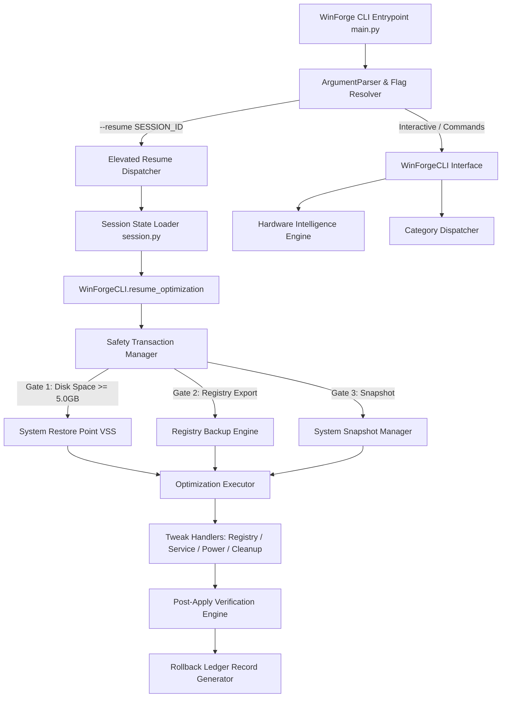
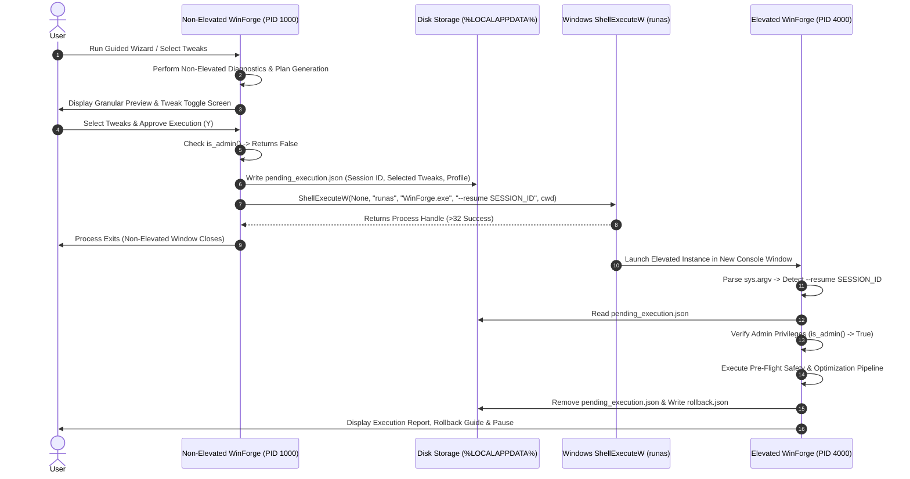

# WinForge Architecture & Internal Engineering Design

This document details the system architecture, component dependencies, and data flow lifecycles of WinForge v1.0.8.

---

## 1. Modular Directory Structure

```
winforge/
├── main.py                   # CLI entrypoint, argument parsing, & subcommand dispatch
├── core/                     # Core business logic & execution drivers
│   ├── engine.py             # System scan & session pipeline orchestration
│   ├── privileges.py         # Non-blocking Admin check & ShellExecuteW elevation
│   ├── session.py            # Session folder & pending execution state persistence
│   ├── safety_approval.py    # 4-Layer real-time safety gate evaluation
│   ├── checksums.py          # SHA-256 tweak definition integrity engine
│   ├── logger.py             # Centralized logger & crash handler
│   └── tweak_loader.py       # JSON tweak recipe deserialization & validation
├── cli/                      # Presentation layer & Rich rendering engine
│   ├── interface.py          # WinForgeCLI interactive menu & resume handler
│   ├── theme.py              # Dark enterprise color tokens & renderer manager
│   ├── components.py         # Dashboard, hardware summary, & report cards
│   ├── renderer.py           # Doctor report, plan preview, & safety lock renderers
│   └── wizard.py             # Guided profile wizard & granular tweak selector
├── models/                   # Pydantic domain models & schemas
│   ├── tweak.py              # Tweak recipe model & schema validator
│   ├── system.py             # System health & diagnostic scan report models
│   ├── rollback.py           # Rollback action & transaction ledger models
│   └── policy.py             # Evaluation finding models
├── safety/                   # System protection & transaction engine
│   ├── transaction.py        # 7-Step Safety Transaction Manager & 5.0GB Disk Gate
│   ├── restore_point.py      # WMI / VSS System Restore Point integration
│   ├── registry_backup.py    # Native reg.exe export & path normalizer
│   ├── snapshot.py           # System state pre/post snapshot engine
│   └── rollback_engine.py    # Inverse atomic rollback executor
├── optimizations/            # Tweak execution dispatchers & handlers
│   ├── executor.py           # OptimizationExecutor 4-phase pipeline manager
│   ├── dispatcher.py         # CategoryDispatcher routing engine
│   ├── verifier.py           # Post-apply tweak verification engine
│   ├── gaming.py             # Gaming & GPU priority optimizer
│   ├── power.py              # Power plan & energy overlay optimizer
│   ├── startup.py            # Startup item & auto-run optimizer
│   ├── services.py           # Service start-type & state optimizer
│   ├── cleanup.py            # Temp & update cache purge optimizer
│   ├── network.py            # TCP auto-tuning & network optimizer
│   └── service_handler.py    # Low-level Windows Service sc.exe controller
├── analyzers/                # Hardware & environment inspection engines
│   ├── hardware.py           # WMI / psutil CPU, RAM, Disk, & GPU collectors
│   ├── hardware_profile.py   # Hardware Intelligence Profile classifier v2
│   ├── os_info.py            # Windows OS edition, build, & UAC state collector
│   └── security.py           # Defender, Firewall, & UAC security auditor
└── utils/                    # Absolute path managers & system utilities
    └── paths.py              # App, executable, bundle, and log path resolvers
```

---

## 2. Component Dependency Graph



---

## 3. UAC Elevation & State Resume Sequence



---

## 4. Design Rationale & Working Directory Independence

1. **Non-Blocking Privileges**: Non-admin users can run diagnostic scans, benchmarks, doctor checks, tweak explanations (`WinForge.exe explain`), and dry-run simulations without elevation prompts.
2. **State Serialization**: Candidate tweak selections are saved to `%LOCALAPPDATA%\WinForge\sessions\pending_execution.json`. When UAC elevation spawns the elevated instance, state resumes without requiring re-selection.
3. **Absolute Path Resolution**: `relaunch_as_admin()` in `winforge/core/privileges.py` explicitly resolves `sys.executable`, script path, and passes `get_executable_dir()` as `lpDirectory` to `ShellExecuteW`, preventing working directory shifts when launched from `C:\Windows\system32`.
