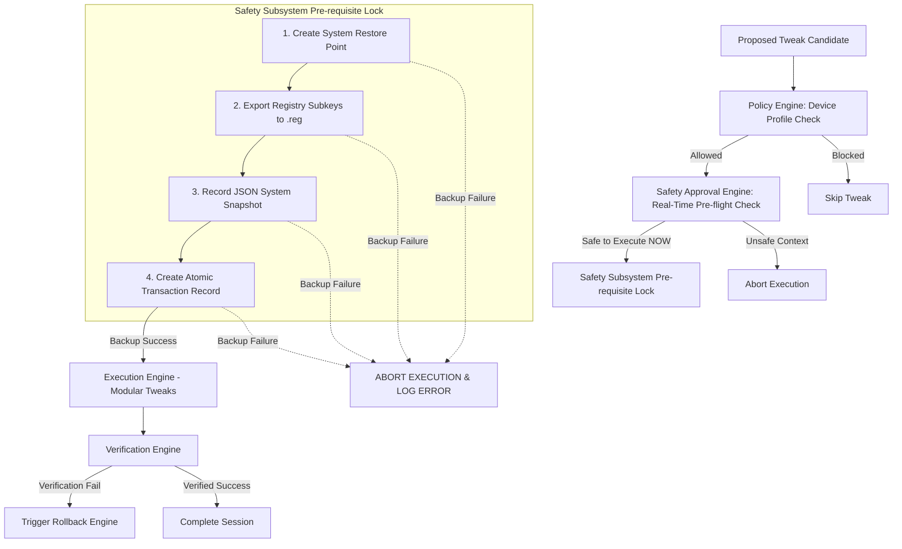

# WinForge: Phase 3 Safety Architecture & Design Document

## 1. Executive Summary

Phase 3 establishes the **Safety Subsystem** and **Controlled Tweak Intelligence Layer** for WinForge. Before any system setting or configuration is modified in future phases, the Safety Subsystem enforces a 4-layer transactional pre-requisite lock:

1. **Windows System Restore Point Creation** (via WMI `SystemRestore` / PowerShell `Checkpoint-Computer`).
2. **Targeted Registry Hive Export** (via `reg export` to `.reg` backup files).
3. **Pre-Optimization JSON State Snapshot** (capturing current registry values, service start types, and power plan GUIDs).
4. **Atomic Transaction Log Creation** (`sessions/<SESSION_ID>/rollback.json`).

**CRITICAL RULE**: If any backup pre-requisite fails, execution is immediately halted, no modifications are attempted, and the system reports a `BACKUP_FAILED` state.

---

## 2. Multi-Stage Pipeline Architecture



### Stage Responsibilities
1. **Policy Engine**: Decides *"Should this tweak be considered for this device context?"* (Checks server OS, laptop battery, domain status, compatibility matrix).
2. **Safety Approval Engine**: Decides *"Is it safe to execute NOW?"* (Checks elevation, free disk space $\ge 2\text{GB}$, battery status $\ge 20\%$, system restore availability, reboot pending status).
3. **Safety Subsystem**: Enforces pre-modification backups and creates atomic transaction ledgers.
4. **Execution Engine**: Performs modular modifications (Phase 4).
5. **Rollback Engine**: Reverts applied tweaks step-by-step in reverse order if verification fails or technician triggers manual rollback.

---

## 3. Safety Subsystem Components (`winforge/safety/`)

### A. `restore_point.py` (Windows Restore Point Creator)
- Wraps WMI `SystemRestore` class (`wmi.WMI(namespace="root/default").SystemRestore`) or PowerShell `Checkpoint-Computer -Description "ANAS_OPTIMIZER_PRE_OPT" -RestorePointType "MODIFY_SETTINGS"`.
- Checks if Windows System Restore is enabled; if disabled, attempts to enable it or returns `RESTORE_POINT_FAILED`.

### B. `registry_backup.py` (Registry Hive Exporter)
- Exports targeted registry keys (e.g. `HKLM\SOFTWARE\Microsoft\Windows NT\CurrentVersion\Multimedia\SystemProfile`) to `sessions/<SESSION_ID>/registry_backups/*.reg` using `reg export`.

### C. `snapshot.py` (System Snapshot Engine)
- Captures JSON snapshot of pre-modification values:
  - Exact registry value data & types.
  - Service startup types (`Automatic`, `Manual`, `Disabled`) and current status.
  - Active power scheme GUID and power settings.

### D. `transaction.py` (Transaction Ledger Manager)
- Manages `RollbackTransaction` data structures.
- Records atomic actions: `action_id`, `tweak_id`, `action_type`, `target`, `previous_value`, `new_value`, `timestamp`.

### E. `rollback_engine.py` (Transactional Rollback Engine)
- Parses `rollback.json` in reverse order.
- Applies inverse actions:
  - Re-imports `.reg` backup files via `reg import`.
  - Re-configures Windows service startup types via `sc config` or Win32 API.
  - Restores power plan GUIDs via `powercfg`.
- If individual tweak reversal fails, provides automated trigger to restore the Windows System Restore Point.

---

## 4. Tweak Database Architecture (`config/tweaks/`)

Tweak definitions are modularized into separate JSON files under `config/tweaks/`:
- `gaming.json`: Timer resolution, GPU priority, Game Mode.
- `cleanup.json`: Safe temporary file counters, prefetch, browser cache routines.
- `startup.json`: Non-essential telemetry startup items.
- `power.json`: Power scheme performance toggles.

### Tier 1 Tweak Schema Specification
Every tweak definition must satisfy the strict Pydantic model:

```json
{
  "id": "TWEAK_GAME_001",
  "name": "GPU Priority Optimization",
  "description": "Sets GPU scheduling priority for games to high performance",
  "category": "GAMING",
  "risk_level": "LOW",
  "schema_version": "2.0.0",
  "supported_windows_versions": ["10", "11"],
  "requires_admin": true,
  "requires_reboot": false,
  "detection_logic": {
    "type": "registry",
    "hive": "HKLM",
    "key": "SOFTWARE\\Microsoft\\Windows NT\\CurrentVersion\\Multimedia\\SystemProfile\\Tasks\\Games",
    "value_name": "GPU Priority",
    "expected_value": 8
  },
  "apply_method": {
    "type": "registry",
    "hive": "HKLM",
    "key": "SOFTWARE\\Microsoft\\Windows NT\\CurrentVersion\\Multimedia\\SystemProfile\\Tasks\\Games",
    "value_name": "GPU Priority",
    "value_type": "REG_DWORD",
    "value_data": 8
  },
  "rollback_method": {
    "type": "registry",
    "hive": "HKLM",
    "key": "SOFTWARE\\Microsoft\\Windows NT\\CurrentVersion\\Multimedia\\SystemProfile\\Tasks\\Games",
    "value_name": "GPU Priority",
    "value_type": "REG_DWORD",
    "value_data": 2
  },
  "verification_method": {
    "type": "registry_match",
    "hive": "HKLM",
    "key": "SOFTWARE\\Microsoft\\Windows NT\\CurrentVersion\\Multimedia\\SystemProfile\\Tasks\\Games",
    "value_name": "GPU Priority",
    "expected_value": 8
  }
}
```

---

## 5. Failure Scenarios & Error Recovery Protocols

| Failure Event | Detection Point | Action Taken | Recovery Behavior |
| :--- | :--- | :--- | :--- |
| **System Restore Disabled / Fail** | `restore_point.py` | Halts execution immediately | Prompts user to enable System Restore or run in dry-run mode. |
| **Registry Export Denied / Fail** | `registry_backup.py` | Halts execution immediately | Logs permission error; zero registry writes performed. |
| **Disk Space < 2 GB** | `safety_approval.py` | Blocks optimization suite | Prompts disk cleanup first before running backups. |
| **Low Battery (< 20%)** | `safety_approval.py` | Blocks backup/optimization | Prevents power cut during backup creation. |
| **Verification Failed Post-Apply** | `verification_engine` | Triggers Rollback Engine | Automatically re-imports `.reg` backup & restores previous state. |
