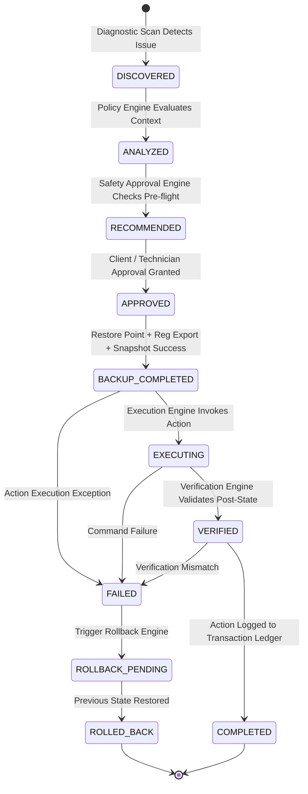

# WinForge: Phase 4 Execution Framework Architecture

## 1. Executive Summary & Design Philosophy

Phase 4 defines the **Execution Framework and State Machine Lifecycle** for WinForge. It bridges the gap between system analysis, safety approval, backup locks, and transaction ledgers.

To ensure commercial-grade reliability, zero silent failures, and complete state reversibility, every tweak transition is strictly governed by a deterministic **State Machine**.

---

## 2. Tweak Execution State Machine



### State Definitions
1. **DISCOVERED**: System diagnostic scan detects a sub-optimal configuration.
2. **ANALYZED**: `PolicyEngine` evaluates device profile (Laptop, Server, Domain-Joined, OS Build).
3. **RECOMMENDED**: `SafetyApprovalEngine` verifies real-time safety pre-flight conditions.
4. **APPROVED**: User (Client Mode profile or Technician Mode manual prompt) approves tweak execution.
5. **BACKUP_COMPLETED**: System Restore Point created, Registry subkeys exported, JSON snapshot written, transaction record initialized.
6. **EXECUTING**: `OptimizationExecutor` applies modification.
7. **VERIFIED**: `TweakVerifier` inspects system state against expected `verification_method`.
8. **COMPLETED**: State change verified and recorded in transaction ledger (`rollback.json`).
9. **FAILED**: Failure detected during execution or verification.
10. **ROLLBACK_PENDING**: Rollback Engine initiated to revert state.
11. **ROLLED_BACK**: System successfully restored to exact pre-execution state.

---

## 3. End-to-End Execution Pipeline Architecture

```
[Tweak Database (config/tweaks/*.json)]
                 │
                 ▼
[Tweak Loader (models/tweak.py)]
                 │
                 ▼
[Policy Engine (core/policy.py)]
                 │
                 ▼
[Safety Approval Engine (core/safety_approval.py)]
                 │
                 ▼
[Technician / Client Approval Interface (cli/prompts.py)]
                 │
                 ▼
[Backup Subsystem (safety/restore_point.py + registry_backup.py + snapshot.py)]
                 │
                 ▼
[Optimization Execution Engine (optimizations/executor.py)]
                 │
                 ▼
[Verification Engine (optimizations/verifier.py)]
                 │
                 ▼
[Transaction Ledger (safety/transaction.py -> rollback.json)]
                 │
                 ▼
[HTML Report Generator (reporting/html_exporter.py -> report.html)]
```

---

## 4. Improved State-Aware Rollback Model

Rather than executing generic static inverse commands, WinForge records the **exact pre-modification state** during the `ANALYZED` phase.

### State Capture Example: Power Plan Optimization
- **Pre-Execution State Captured**: Active Power Plan GUID = `381b4222-f694-41f0-9685-ff5bb260df2e` (`Balanced`).
- **Optimization Executed**: Active Power Plan GUID set to `8c5e7fda-e8bf-4a96-9a85-a6e23a8c635c` (`High Performance`).
- **Rollback Operation**: Restores exact captured GUID `381b4222-f694-41f0-9685-ff5bb260df2e` (`Balanced`).

---

## 5. Technician Mode vs. Client Mode Workflow

### Client Mode
- Displays high-level health score card and automated safe recommendations (`LOW` risk, `technician_only: false`).
- Single approval prompt triggers execution of safe profiles.

### Technician Mode (`--tech`)
- Interactive tweak inspection prompt displaying:
  - **Tweak ID & Name**
  - **Risk Rating & Category**
  - **Estimated Performance Impact** (`performance_gain_estimate`)
  - **User-Visible Changes** (`user_visible_change`)
  - **Exact Before State vs. Expected After State**
  - **Rollback Method**
- Per-tweak granular approval (`[A]pprove`, `[S]kip`, `[B]atch Approve All`).
